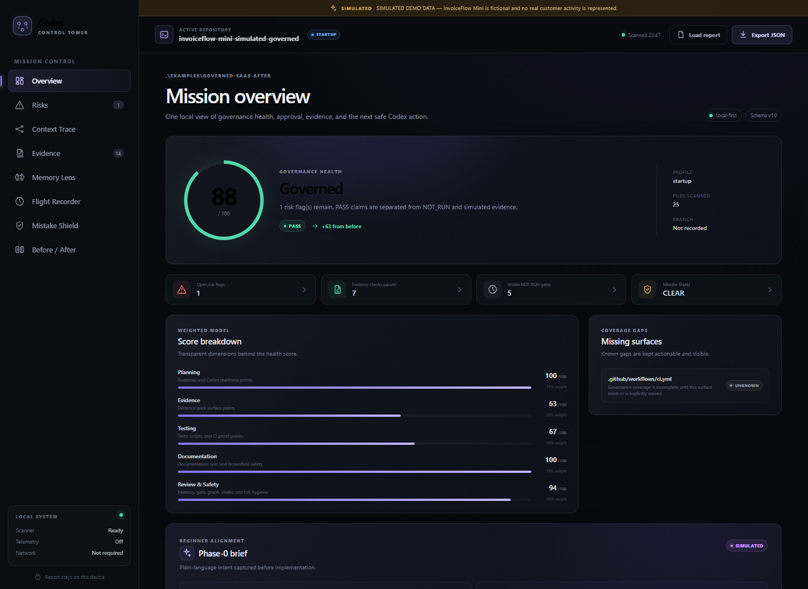

# Codex Control Tower

> **Mission control for AI-built software.**

Codex Control Tower uses a real, read-only GPT-5.6 run to independently challenge neutral claims and bounded raw evidence while the reconciler's locked claim-status fields and expected comparison classes are withheld—and GPT-5.6 can never overwrite the locked local facts.

**OpenAI Build Week Developer Tools entry · real Blind GPT-5.6 Semantic Audit · deterministic authority · no API key required · fictional sample separated from real execution**

**[Open the no-install judge demo](https://zyganali-glitch.github.io/codex-control-tower/)** · **[Judge: start here](JUDGE_START_HERE.md)**

*InvoiceFlow Mini is a fictional sample project. Its prepared before/after snapshots are not customer evidence. The scans, two fixture tests, hashed evidence bundle, provenance checks, and recorded GPT-5.6 run are real tool outputs.*

## 30-Second Explanation

Codex can move from request to implementation quickly. The developer still needs durable answers: what was planned, which files were allowed, what changed, what ran, which checks were skipped, whether the tests actually address the mission, and what the next session may safely do.

Control Tower turns repository state into a bounded Codex mission and locks local evidence states. It then gives real GPT-5.6 neutral claims and bounded raw evidence while withholding the reconciler's locked claim-status fields and expected comparison classes. Raw evidence can contain its own status words because those are material to audit; they are not disclosed as the answer target. GPT-5.6 returns `SUPPORTS`, `CONTRADICTS`, or `INSUFFICIENT`, plus cited counter-evidence, missing evidence, and a proposed next action. Local code compares the independent answer with the hidden local comparison policy afterward. A policy conflict raises **HUMAN REVIEW REQUIRED** but never changes PASS, WARN, FAIL, NOT_RUN, SIMULATED, the deterministic verdict, or the developer's Review Gate.

**Main loop:** local scan → bounded Codex mission → locked facts → blind GPT-5.6 semantic challenge → deterministic reconciliation → human decision → evidence handoff.

> **Codex writes. GPT-5.6 challenges. Control Tower locks the facts. The developer decides.**

## Why This Is Different

A model that sees “the answer should be PASS” can merely echo it. Control Tower deliberately withholds that answer. The Blind Semantic Challenge asks GPT-5.6 to reason about the relationship among the mission, changes, tests, test output, and evidence. The local layer is good at facts such as “this command exited zero” or “this gate did not run”; GPT-5.6 is used for the different question: “does this proof actually support the stated mission?”

The `MISSION_CHANGE_TEST_ALIGNMENT` challenge is repository-independent. It compares Phase-0 goals and success criteria with change evidence, test source, test output, and the evidence record. If a narrow passing test does not prove the broader mission, GPT-5.6 can contradict the claim and trigger human review. Its answer is useful precisely because it cannot promote or erase local evidence.

**CCT does not replace ESLint, CI, code review, or branch protection. It adds the evidence and handoff layer around agent-assisted work.**

## Core Features

| Feature | What the developer gets |
| --- | --- |
| **Blind GPT-5.6 Semantic Audit** | Real `gpt-5.6-sol` reviews neutral claims and bounded raw evidence in an empty ephemeral no-tool workspace while locked claim-status fields and expected comparison classes are withheld. |
| **Deterministic Reconciliation** | The model's `SUPPORTS / CONTRADICTS / INSUFFICIENT` opinion is compared only after it returns; local facts and verdicts stay locked. |
| **Human Review Required** | A visible advisory flag when semantic model judgment conflicts with local structural evidence; it never silently changes evidence state. |
| **Codex Mission Prompt** | A concrete next mission built from repository state, risks, allowed scope, forbidden actions, tests, evidence, and approval requirements. |
| **Context Trace** | Selected files, plans, tests, evidence, and memory with reasons, relevance, freshness, importance, and protection signals. |
| **Review Gate** | A visible local AWAITING_HUMAN, APPROVED, REJECTED, or BLOCKED decision artifact with explicit scope. |
| **Mistake Shield** | CLEAR, CAUTION, or BLOCKED with matched risks and a safer rewrite—never a silent block. |
| **Flight Recorder** | Local JSONL history across prompts, plans, changes, tests, evidence, approvals, risks, and skipped checks. |
| **Memory Lens** | Durable rules, minefields, architecture principles, environment constraints, preferences, and continuity signals. |
| **Evidence Boundary** | PASS, WARN, FAIL, NOT_RUN, and SIMULATED remain distinct and tied to named artifacts. |
| **Before / After Dashboard** | Reproducible comparison of governance score, risk, evidence, approval, and continuity on a fictional fixture. |
| **Devpost Pack Exporter** | A secondary evidence/handoff output: submission text, demo plan, judging map, command list, limitations, and evidence map. |

## Fast Judge Path

1. Read [Judge: Start Here](JUDGE_START_HERE.md).
2. Open the [GitHub Pages dashboard](https://zyganali-glitch.github.io/codex-control-tower/); no installation is required.
3. Read the separate **FICTIONAL SAMPLE PROJECT** and **REAL EXECUTION** disclosures.
4. Inspect **Blind GPT-5.6 Semantic Audit**: exact model, read-only provenance, independent assessment, evidence citations, reconciliation, and any **HUMAN REVIEW REQUIRED** flag.
5. Open **Before / After** for the reproducible `25 → 88` score and `16 → 1` risk comparison.
6. Open **Evidence** and confirm unavailable gates remain NOT_RUN.

The Pages site is a static, read-only judge exhibit. It shows sanitized fictional sample content and a committed record of a real GPT-5.6 execution. It cannot scan a visitor's repository or show a new local run. The full evaluation route is in [Judge Test Path](docs/JUDGE_TEST_PATH.md).

### Version and cache safety

Some external preview tools cache a previously opened README. The submitted source authority is the [frozen `openai-build-week-final` tag](https://github.com/zyganali-glitch/codex-control-tower/tree/openai-build-week-final), not a cached summary or an older commit. [Submission Manifest](docs/SUBMISSION_MANIFEST.md) separates the frozen tag, moving `main` branch, current workflow history, and static Pages exhibit. If a preview omits the Blind GPT-5.6 Semantic Audit, open the tag or [Judge: Start Here](JUDGE_START_HERE.md) directly.

## Quick Start

Requires Node.js 18 or newer.

~~~bash
npm install
npm run demo
npm run dashboard
~~~

The deterministic path requires no OpenAI API key. The featured model path uses the ChatGPT account already signed in to Codex and requires access to `gpt-5.6-sol`.

For the real run, open this repository in the Codex desktop app and give Codex this instruction:

~~~text
Without editing any files, run `npm run demo:codex` for this project. Keep the run read-only. When it completes, report the exact model, the deterministic local verdict, the separate GPT-5.6 verdict, SUPPORTS / CONTRADICTS / INSUFFICIENT counts, whether HUMAN REVIEW REQUIRED was raised, the preserved NOT_RUN count, evidence freshness, and the evidence-record path. If it fails, show the real failure and do not replace it with simulated success.
~~~

`npm run demo:codex` verifies the signed-in ChatGPT session and model catalog, then invokes real `gpt-5.6-sol` with medium reasoning inside an empty temporary workspace. The run is read-only and ephemeral; user configuration, project rules/instructions, web search, and approval escalation are disabled. Local code rejects any command, file, MCP, web-search, plan, unknown, failed, or malformed Codex event. It also validates the structured result, requires allowed citations for decisive assessments, records hashes and Git provenance, and performs the local reconciliation. The Codex dependency is pinned to `0.144.3` so this fail-closed event contract cannot silently drift. There is no hidden fallback to deterministic or simulated output.

For the exact Codex instruction, see [Codex Demo Prompt](docs/CODEX_DEMO_PROMPT.md). For a click-by-click Turkish guide written for someone new to computers, see [Türkçe Demo Çekim Rehberi](docs/DEMO_REHBERI_TR.md).

## What Is Real and What Is Fictional

**FICTIONAL SAMPLE PROJECT:** InvoiceFlow Mini is a controlled invoice/customer/payment example created only for this repository. Its actors, approvals, customer facts, and prepared before/governed snapshots are fictional. GPT-5.6 did not create the snapshots and did not cause the score change.

**REAL EXECUTION:** Control Tower really scans both snapshots, calculates the heuristic scores, runs two focused Node.js fixture tests, builds and hashes evidence, records provenance/freshness, and invokes real `gpt-5.6-sol` read-only. These are bounded tool outputs—not customer validation, production readiness, a correctness guarantee, or independent security review.

The prepared comparison is reproducible:

| Signal | Messy prepared snapshot | Governed prepared snapshot |
| --- | ---: | ---: |
| Governance score | 25/100 | 88/100 |
| Risk flags | 16 | 1 |
| Focused Node fixture tests | Placeholder/weak | 2 passed, 0 failed |
| Browser, load, deployment, provider, independent security | NOT_RUN | NOT_RUN |

The product also scans its own repository with `npm run evidence:self`. The committed [root scan](docs/ROOT_REPO_SCAN.json) is structural governance evidence only; it is not a correctness or security certificate. Regenerate it to assess the current checkout.

## Blind GPT-5.6 Audit: Exact Authority Boundary

`npm run demo:codex` performs this sequence:

1. Local code derives neutral, target-appropriate claims and collects only the allowlisted raw evidence.
2. Local code independently computes and locks structural/execution states and the deterministic verdict. For `MISSION_CHANGE_TEST_ALIGNMENT`, local `PASS` is labeled only as a **structural precheck**; it is not a deterministic claim that semantic coverage is true.
3. Codex runs in an empty temporary workspace with user configuration, project instructions/rules, web search, and approval escalation disabled. The prompt contains the bounded bundle but withholds the reconciler's locked claim-status fields, deterministic verdict, and expected comparison classes. Raw evidence may still contain its own status labels because those labels are part of the material being challenged.
4. GPT-5.6 returns one assessment per claim: `SUPPORTS`, `CONTRADICTS`, or `INSUFFICIENT`, with citations, reasoning, counter-evidence, missing evidence, and a recommended next action.
5. Local validation rejects every tool-use event, missing/duplicate claim, injected local status field, malformed record, decisive answer without an allowed citation, `CONTRADICTS` without counter-evidence, `INSUFFICIENT` without missing evidence, unsupported citation, and statement implying the model itself executed a test.
6. Only after the event stream and structured response are accepted does the reconciler compare semantic judgment with the hidden local comparison policy. `INSUFFICIENT` can be marked `COMPATIBLE` with a negative/unexecuted local state without being overstated as full agreement.
7. When the model assessment conflicts with that policy, reconciliation raises `HUMAN_REVIEW_REQUIRED`. A `CONTRADICTS` answer is not automatically a conflict—for example, it can align with a locked FAIL. The flag is advisory: evidence states, local verdict, local next safe action, and human Review Gate remain authoritative.

This is an independent challenge inside the product, not an independent third-party attestation. A model opinion can be wrong; the dashboard preserves both layers so the developer can inspect the disagreement.

## Demo Recording Path

The video opens with the completed GitHub Pages GPT-5.6 panel in the first ten seconds, so judges immediately see the real model role. It then moves to the local workbench at READY, shows Codex desktop launching `npm run demo:codex`, and returns to the dashboard for RUNNING/COMPLETE and reconciliation. GitHub Pages is the no-install public exhibit; the local dashboard is required only to demonstrate a fresh state transition.

Follow the [under-3-minute Demo Script](docs/DEMO_SCRIPT.md). The spoken narration explicitly explains both Codex and GPT-5.6. The private `/feedback` Session ID comes from the primary Codex build task and belongs only in the Devpost form; it is intentionally never committed to this public repository.

## CLI

The package exposes the `cct` binary. Every command is also available as `node cli/index.js <command>`.

~~~bash
cct init --target . --profile startup --codex
cct phase0 --target .
cct scan --target . --out report.json
cct health --target .
cct doctor --target .
cct context-graph --target . --out context-graph.json
cct codex-review --target . --model gpt-5.6-sol
cct review-gate --target . --status
cct mistake-shield --target . --action "Refactor auth and delete old tests"
cct memory-lens --target . --out memory-lens.json
cct flight-recorder --target . --event TEST --message "Focused test command completed"
cct evidence --target . --out evidence-pack
cct export-devpost --target . --out devpost-pack
~~~

Phase-0 is English-only in this Build Week version. Multilingual product packs are future work. The Turkish file in `docs/` is recording help for the project owner, not an active product locale.

## Dashboard Surfaces

| Surface | What it proves or displays |
| --- | --- |
| **Overview** | Health, readiness, review state, next safe action, score, mission prompt, and Phase-0 context. |
| **Blind GPT-5.6 Semantic Audit** | READY/RUNNING/COMPLETE, exact model/access/mode, neutral claims, independent assessments, citations, counter-evidence, missing evidence, reconciliation, and human-review flag. |
| **Risks** | Severity, affected area, why a finding matters, and mitigation. |
| **Context Trace** | Selected repository items and the reason each entered the bounded mission context. |
| **Evidence** | PASS/WARN/FAIL/NOT_RUN/SIMULATED boundary and named proof. |
| **Memory Lens** | Durable rules, minefields, preferences, staleness, and continuity. |
| **Flight Recorder** | Prompt, plan, change, test, evidence, approval, and risk events. |
| **Mistake Shield** | Proposed action, CLEAR/CAUTION/BLOCKED result, reasons, and a safer rewrite. |
| **Before / After** | Controlled messy/governed fixture comparison. |

The local dashboard can load a local JSON report and watch the explicit audit record. It never uploads a report by itself. The Pages build is a static sanitized snapshot and cannot observe local state changes.

## OpenAI Build Week Fit

Codex Control Tower is a working developer tool and AI-agent collaboration layer built with Codex. It combines a Node.js CLI, deterministic repository analysis, bounded context and mission generation, real GPT-5.6 semantic reasoning, strict structured-output validation, an authority-preserving reconciler, portable evidence artifacts, controlled fixtures, and a React dashboard.

Codex accelerated requirements synthesis, architecture, implementation, test creation, failure diagnosis, documentation, and release verification. GPT-5.6 also has a visible runtime role: it is a deliberately blind semantic challenger rather than a score generator or a rubber stamp. The developer made and retained the product-defining decisions about evidence authority, scope, safety, disclosure, and publication.

The detailed official-criteria mapping is in [Judging Map](docs/JUDGING_MAP.md), and the build provenance is in [Codex Build Log](docs/CODEX_BUILD_LOG.md) and [Build Week Development Delta](docs/BUILD_WEEK_DELTA.md).

## Supported and Verified Boundaries

| Platform | Status | Boundary |
| --- | --- | --- |
| Windows 10 Pro | VERIFIED | Full tests, dashboard build, signed-in Codex CLI, and real `gpt-5.6-sol` execution were run locally. |
| Ubuntu (`ubuntu-latest`) | VERIFIED for deterministic path | GitHub Actions installs, tests, runs the deterministic demo, and builds the dashboard. The signed-in model step is not run in CI. |
| macOS | NOT_RUN | Portability is expected but no named macOS execution artifact exists for this version. |

## Lineage and Originality

Codex Control Tower is an independent Codex-native product inspired at concept level by the **Universal Agent OS family**: alignment, evidence-first delivery, human review, context, continuity, and mistake prevention. The family was studied read-only, is not a runtime dependency, and is never used as the demo target. This product transforms those lessons into a bounded mission-control workflow and blind GPT-5.6 evidence challenge.

The transformation and no-copy record is in [Source Protection](docs/SOURCE_PROTECTION.md), [Source Research Matrix](docs/SOURCE_RESEARCH_MATRIX.md), [Feature Harvest](docs/FEATURE_HARVEST.md), and [Originality Matrix](docs/ORIGINALITY_MATRIX.md).

## Privacy, Safety, and Honest Limits

- Deterministic scanning, scoring, context selection, and report generation are local-first and have no telemetry.
- The real GPT-5.6 step is explicit opt-in and sends only the displayed bounded evidence bundle through the signed-in ChatGPT session. Its empty ephemeral workspace and fail-closed event policy reject file, command, MCP, web-search, plan, and unknown tool events.
- Generated reports can include sensitive filenames, paths, plans, and risks; review before sharing.
- Scanner findings and scores are heuristics and can have false positives or false negatives.
- Review Gate is a local unsigned file, not identity verification or OS enforcement.
- Flight Recorder is inspectable JSONL, not a tamper-proof ledger.
- A Mistake Shield CLEAR result does not mean an action is risk-free.
- PASS requires named evidence. A file's existence does not prove a command ran.
- NOT_RUN never becomes PASS because a model sounds confident.
- SIMULATED fixture facts remain separate from real executions on the fixture.

See [Architecture](docs/ARCHITECTURE.md), [Privacy and Security](docs/PRIVACY_AND_SECURITY.md), and [Honest Limitations](docs/LIMITATIONS.md).

## Submission Assets

- [Judge: Start Here](JUDGE_START_HERE.md)
- [Submission Manifest](docs/SUBMISSION_MANIFEST.md)
- [Devpost Submission Draft](docs/DEVPOST_SUBMISSION.md)
- [Under-3-minute Demo Script](docs/DEMO_SCRIPT.md)
- [Türkçe Demo Çekim Rehberi](docs/DEMO_REHBERI_TR.md)
- [Codex Demo Prompt](docs/CODEX_DEMO_PROMPT.md)
- [Judge Test Path](docs/JUDGE_TEST_PATH.md)
- [Judging Map](docs/JUDGING_MAP.md)
- [Build Week Development Delta](docs/BUILD_WEEK_DELTA.md)
- [Codex Build Log](docs/CODEX_BUILD_LOG.md)

## Roadmap

- More target-derived challenge policies and language-aware claim adapters
- GitHub/GitLab PR/MR and CI integrations
- Signed or identity-backed Review Gates and evidence attestations
- Team and cross-repository dashboards
- Multilingual product packs

Roadmap items are future work, not current capability.

## License

Codex Control Tower is released under the [MIT License](LICENSE).
